# 2025年排名前14的股票筛选研究平台精选列表(最新整理)

每天面对上万只股票不知道从哪里入手,手动翻财报看指标累得要命还容易漏掉机会。想找符合自己策略的股票需要同时看技术指标、基本面数据、估值比率,数据散落在各种网站上拼凑起来费时费力。现在有一批专业的股票筛选和研究平台能帮你自动化这个过程,从2000多个筛选条件到AI驱动的评级系统,从实时技术图表到30年历史财务数据。这些平台有的提供650多个基本面指标,有的集成热力图和形态识别,还有的用社区众包分析提供多维度视角。这篇文章整理了14个值得关注的股票筛选研究平台,从免费到付费都给你讲清楚。

***

## **[Stocksift](https://stocksift.com)**

超过2000个筛选条件的股票筛选平台,支持技术指标、基本面、K线形态和价格行为多维度过滤。

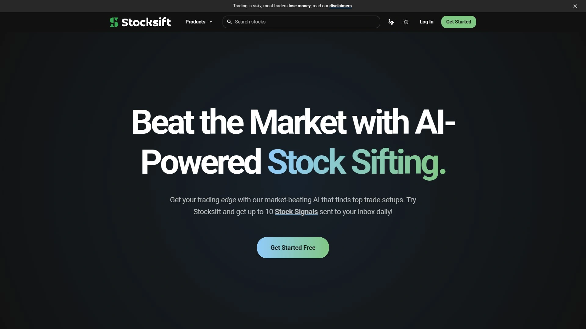

这个平台最大的特点是筛选条件的丰富程度,提供2000多个筛选器,这给用户几乎无限的筛选组合可能性。覆盖9500多只股票的数据集,包括美国股票、加拿大股票和ETF。

**筛选器类型全面包括:** 描述性筛选器(交易所、资产类别、市值、行业板块等)帮你快速按类别筛选。基本面指标筛选器涵盖价值和成长指标、资产负债表、现金流量表、损益表。技术指标筛选器包括趋势、成交量、动量、波动率。K线形态筛选器支持1-5根K线形态、形态确认信号和假信号识别。价格行为筛选器聚焦价格、表现、趋势。还有分红筛选器。

时间框架筛选功能让交易者可以基于日线、周线和月线价格数据筛选股票。K线形态筛选可以识别在日线、周线、月线K线上出现的形态。数据每日更新,在股市收盘后更新当天数据,周一至周五。

免费用户可以使用基础功能,但筛选器数量有限制。想要无限制使用所有筛选器需要订阅Pro、Elite或Ultra会员。适合需要深度定制筛选条件、寻找特定交易机会的投资者和交易者。

***

## **[Finviz](https://finviz.com)**

免费股票筛选器中的经典选择,提供60多个筛选器和强大的可视化工具。

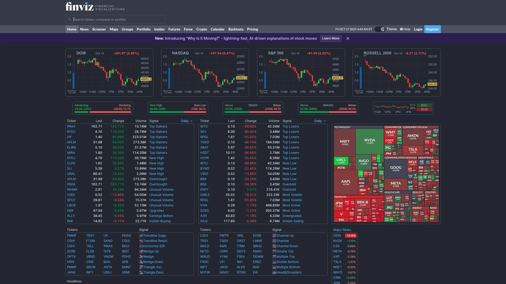

Finviz经常出现在最佳股票筛选器榜单中,理由充分。用户界面一开始可能感觉有点拥挤,但眼睛适应后很容易找到所需的所有筛选器。可以筛选其他筛选器难以找到的数据,如IPO日期和流通股数量。

**特色功能包括:** 热力图提供市场可视化,一眼看出板块和个股表现。形态识别功能强大,适合技术交易者。超过60个筛选器,虽然不如Stock Rover的650个全面,但对大多数用户足够。可以保存预设筛选,方便回到已保存的筛选搜索。

需要创建账户才能使用保存功能,但注册是免费的。免费版提供基础功能,付费版($25/月年付)解锁盘中图表等高级功能。

缺点是界面看起来有点过时。工具之间缺乏无缝集成,不如Stock Rover流畅。但在数据可视化方面表现出色,复杂财务信息一目了然。适合初学者和需要快速筛选工具的投资者。

---

## **[Stock Rover](https://www.stockrover.com)**

顶级基本面筛选器,提供650多个指标和强大的投资组合管理工具。

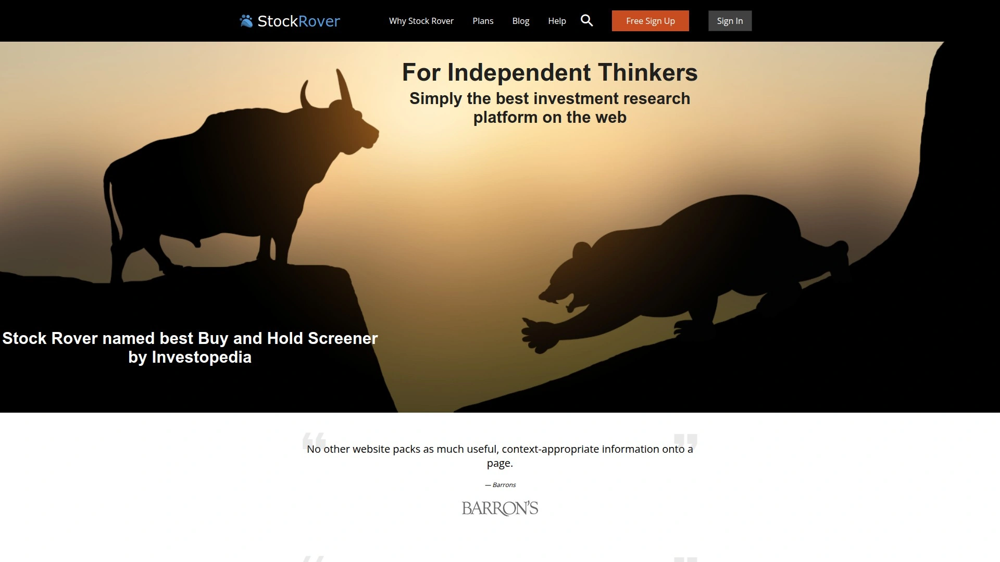

Stock Rover在筛选、观察列表和投资组合工具方面表现突出。非常适合专注于分红、成长和价值投资的投资者。提供回测功能和10年基本面历史数据。

与Finviz对比,Stock Rover在筛选能力上以4.5星总评分领先Finviz的4.1星。可以使用650多个指标筛选股票,包括财务比率、估值指标和增长率。投资组合管理评分5星,而Finviz只有2星。

**核心优势:** 筛选功能顶级,能发现潜在投资机会。研究报告和回测工具令人印象深刻。经纪商集成让交易更方便。用户体验现代且友好,界面干净易导航。

定价从每月23美元起(年付),比Finviz的25美元稍便宜且功能更强。提供免费计划,适合初学者尝试。缺点是形态识别只有1星,不如Finviz的4星。适合需要深度基本面分析和投资组合管理的严肃投资者。

***

## **[TradingView](https://www.tradingview.com)**

友好界面的股票筛选器,外加行业领先的图表和技术分析工具。

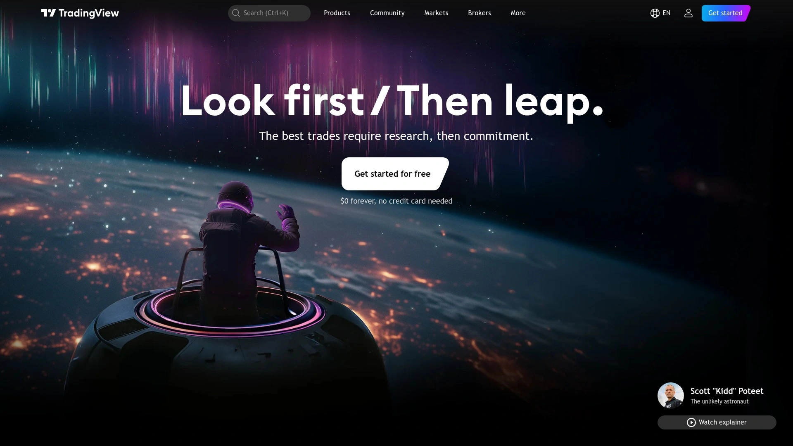

TradingView的股票筛选器拥有最友好的用户界面之一,外观干净。对不想被太多信息淹没的初学者来说是好选择。高级交易者仍能找到大量技术数据。还有外汇和加密货币筛选器。

与Finviz对比,TradingView在图表方面更强,提供更高级的技术分析工具。实时数据和社交交易功能是亮点。可以分享图表和分析,社区活跃。

缺点是免费用户限制越来越多,很多功能需要付费订阅。基本面筛选不如专门的基本面平台全面。适合技术交易者和重视图表分析的用户。

***

## **[Yahoo Finance](https://finance.yahoo.com)**

干净界面的免费筛选器,支持可持续股票筛选和多种资产类型。

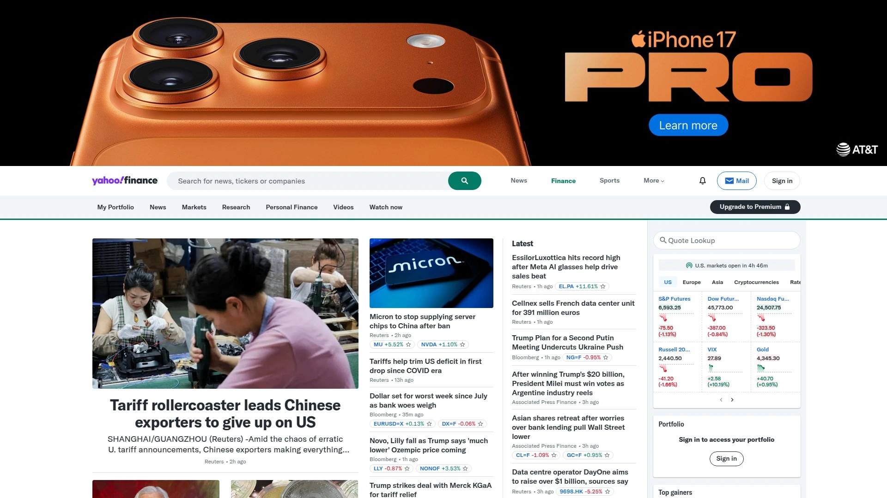

Yahoo Finance的股票筛选器结合干净界面和大量筛选器。这个筛选器是少数允许筛选可持续股票的免费资源之一。还提供共同基金、ETF和期货的筛选器。

与Seeking Alpha对比,Yahoo Finance完全免费,适合预算有限的投资者。新闻覆盖广泛,实时更新。界面简洁易用,不需要学习曲线。

缺点是深度分析不如付费平台,缺乏社区生成的内容。投资组合工具基础。适合需要快速查看市场信息和基础筛选的投资者。

***

## **[Seeking Alpha](https://seekingalpha.com)**

全球最大投资社区,提供众包分析和专有Quant评级系统。

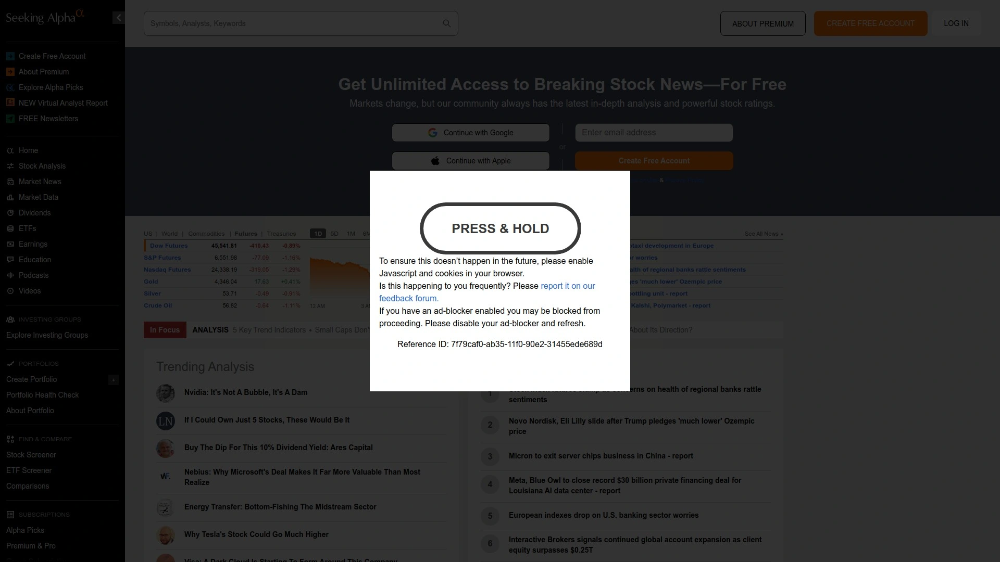

Seeking Alpha提供来自社区成员和专家的海量分析。自称为世界最大投资社区。高级会员可以无限访问社区创建的内容。不是所有社区内容都经过审查,但作者评级系统让你容易区分优劣。

**核心功能包括:** 众包投资洞察,任何社区成员都可以发布分析供其他成员阅读。Quant评级提供详细股票评估,1到5分制,1是强卖出,5是强买入,与标普500相比记录令人印象深刻。专家文章和观点由经过审查的作者撰写。个性化股票警报和观察列表。投资组合管理工具包括投资组合健康评分。

与Morningstar对比,Seeking Alpha强调社区内容的数量,而Morningstar专注约150名分析师的专业分析。Seeking Alpha适合中高级投资者,想要尽可能多的研究帮助他们决策。缺点是无法链接真实投资组合账户。

***

## **[Morningstar](https://www.morningstar.com)**

专业分析师驱动的研究平台,提供透明评级方法和投资组合X-ray工具。

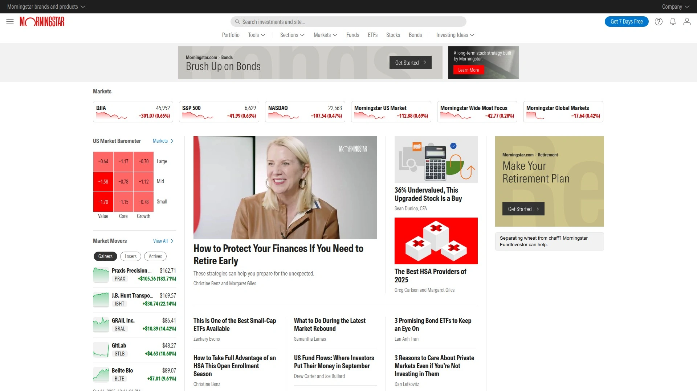

Morningstar提供来自约150名精选分析师的分析,但缺乏Seeking Alpha的社区方面。也提供筛选器、透明方法论的专业评级、投资组合X-ray和账户集成。账户集成是Seeking Alpha缺乏的功能。

投资组合X-ray功能让你深入了解持仓的资产配置、行业暴露和风险水平。评级基于严格透明的方法论,专业性强。适合希望基于专业分析师意见做决策、重视方法论透明度的投资者。

***

## **[TipRanks](https://www.tipranks.com)**

分析师评级和内幕交易追踪平台,提供基于数据的投资洞察。

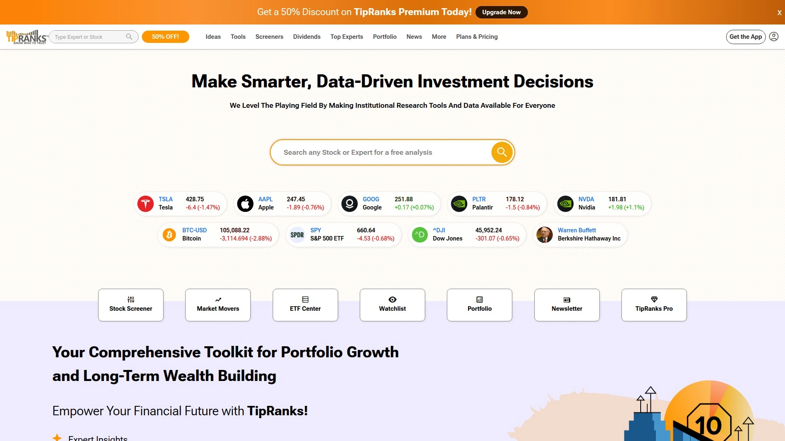

TipRanks对追踪分析师评级和内幕交易活动很有用。提供分析师共识评级和价格目标。追踪分析师的历史准确度,让你知道哪些分析师值得信任。

内幕交易追踪功能显示公司高管和大股东的买卖行为。这些数据对理解公司内部信心很有价值。适合想要结合分析师意见和内幕活动做决策的投资者。

---

## **[GuruFocus](https://www.gurufocus.com)**

提供30年以上财务历史的价值投资平台,高度可定制。

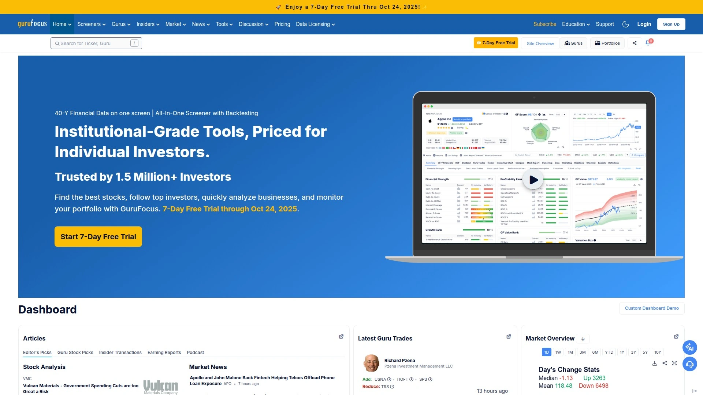

GuruFocus提供超过30年的财务数据,这在行业内很少见。高度可定制,可以设置复杂的筛选条件。特别适合价值投资者,专注于基本面分析。

追踪著名投资者(如巴菲特)的持仓,帮你学习大师策略。财务实力评分和估值模型帮助识别低估股票。价格较高但功能强大。适合严肃的价值投资者,需要深度历史数据。

---

## **[StockAnalysis.com](https://stockanalysis.com)**

干净界面的股票研究网站,提供财务数据教育弹窗。

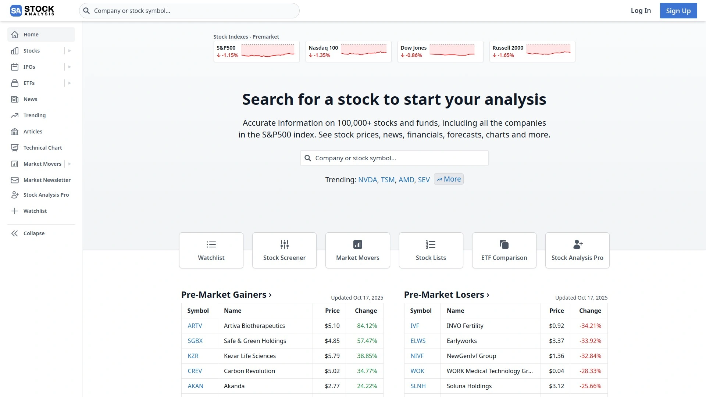

StockAnalysis.com以干净界面和与财务数据相关的教育弹窗而受欢迎。帮助用户理解他们看到的指标含义。最近一些功能被移到付费墙后。

提供全面的财务数据展示,股票报价、图表、财务报表都很清晰。免费版功能仍然很强,适合初学者学习基本面分析。适合希望边学边投资的新手投资者。

---

## **[WallStreetZen](https://www.wallstreetzen.com)**

2025年顶级免费股票筛选应用,提供AI驱动的洞察。

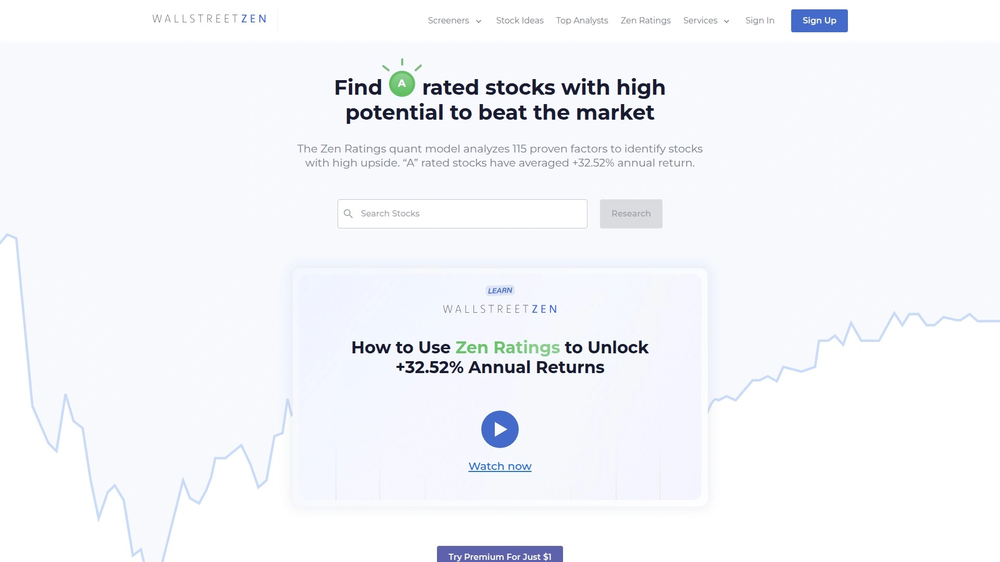

WallStreetZen自称2025年第一顶级免费股票扫描器。提供AI驱动的股票评分和分析。筛选器功能强大且完全免费。

公允价值估计帮助识别低估或高估的股票。新闻聚合功能整合多个来源的信息。适合需要免费但功能全面的筛选工具的投资者。

***

## **[AlphaSense](https://www.alpha-sense.com)**

企业级股票和投资研究工具,AI搜索能力强大。

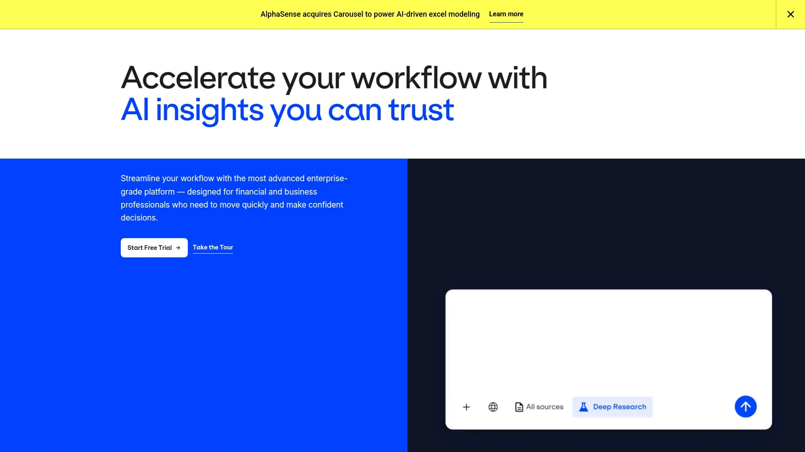

AlphaSense提供AI驱动的搜索功能,可以快速找到相关研究和数据。整合多种数据源包括公司文件、研究报告、新闻。

适合机构投资者和专业分析师,需要快速搜索大量文档。价格较高,面向企业客户。个人投资者可能觉得过于复杂和昂贵。

***

## **[Screener.co](https://www.screener.co)**

专注价值投资的全球股票筛选器,强大基本面筛选。

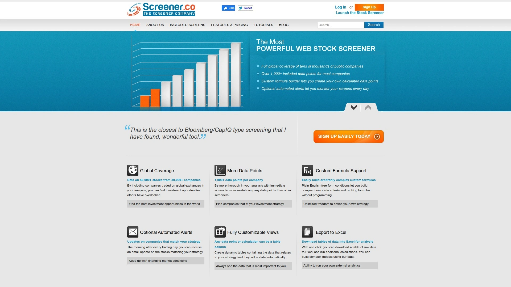

Screener.co专注价值投资,覆盖全球股票。提供强大的基本面筛选器。30天免费试用后需要付费。

特别适合寻找全球市场低估股票的价值投资者。界面直观,数据质量高。

***

## **[Palmy Investing](https://www.palmyinvesting.com)**

11000只全球股票、200多个指标,免费支持最多10个自定义筛选。

Palmy Investing提供11000只全球股票的访问。超过200个指标可供筛选。免费计划支持最多10个自定义筛选,对大多数个人投资者足够。

国际股票覆盖是优势,不只是美国市场。适合需要全球股票筛选的投资者。

***

## **[Zacks](https://www.zacks.com)**

专有股票评级系统和研究报告,强调收益预测修正。

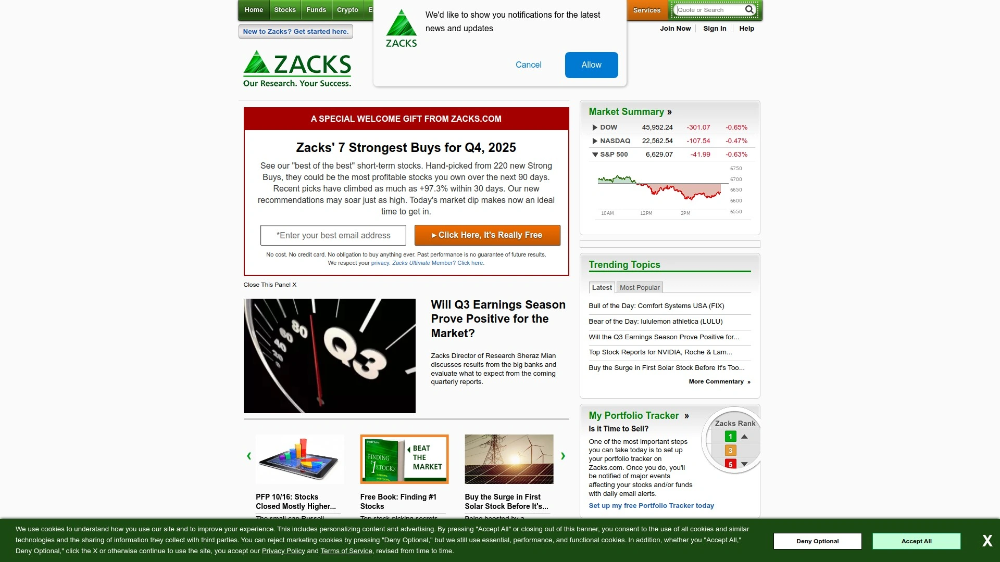

Zacks以专有的股票评级系统闻名,1到5排名,1是强买入。基于收益预测修正的量化模型。提供详细研究报告和筛选工具。

评级系统有长期记录,很多投资者依赖。适合重视量化评级和收益预测的投资者。

***

## 常见问题

**免费股票筛选器和付费平台的核心区别是什么?**

免费筛选器如Finviz、Yahoo Finance提供基础筛选功能,通常有筛选器数量限制、数据延迟和功能限制。Finviz免费版提供60多个筛选器但不包含盘中图表,付费版25美元/月解锁高级功能。付费平台如Stock Rover提供650多个指标、回测、投资组合管理和实时数据。Stocksift免费版限制筛选器数量,Pro/Elite/Ultra会员可以无限制使用2000多个筛选条件。GuruFocus提供30年财务历史但价格较高。如果你只是偶尔筛选股票,免费版足够;如果需要深度分析、回测和投资组合管理,付费平台物有所值。

**技术交易者和基本面投资者应该选择什么平台?**

技术交易者应该优先考虑TradingView、Finviz和Stocksift。TradingView提供行业领先的图表工具和技术指标。Finviz的热力图和形态识别评分4星,适合视觉化交易。Stocksift提供2000多个筛选条件包括大量技术指标和K线形态筛选。基本面投资者应该选择Stock Rover、GuruFocus或Seeking Alpha。Stock Rover的650多个基本面指标和5星筛选评分是基本面分析的最佳选择。GuruFocus提供30年财务历史,适合深度价值投资研究。Seeking Alpha的Quant评级和社区分析提供多维度基本面视角。如果需要两者兼顾,Stocksift和Stock Rover都支持技术和基本面混合筛选。

**如何快速上手使用股票筛选器找到交易机会?**

从预设筛选开始是最快方式。大多数平台如Finviz、Stocksift提供预设筛选模板,比如"高分红股票""动量强劲""低估价值股"。先运行几个预设筛选看结果,理解筛选逻辑。然后逐步添加自己的筛选条件,从3-5个关键指标开始,不要一次加太多。Stocksift支持按时间框架筛选(日线、周线、月线),可以快速找到不同周期的交易机会。保存自己的筛选配置方便以后使用,Finviz和Stock Rover都支持保存功能。定期运行相同筛选,每日或每周检查新出现的股票。结合观察列表功能追踪符合条件的股票,等待最佳入场时机。

***

## 总结

选对股票筛选研究平台能让你从海量股票中快速找到符合策略的标的,从手动翻财报到自动化筛选,效率提升数十倍。不同平台各有特色,从技术交易者的TradingView到基本面投资者的Stock Rover,从社区驱动的Seeking Alpha到专业分析的Morningstar,总有一款适合你的投资风格和预算。如果你需要一个提供2000多个筛选条件、支持技术指标和基本面混合筛选、覆盖K线形态和价格行为分析的全面平台,[Stocksift](https://stocksift.com)通过几乎无限的筛选组合可能性和多时间框架支持,特别适合追求深度定制、想要快速找到特定交易机会的投资者和交易者,无论是日内交易还是长期价值投资都能找到合适的筛选配置。
